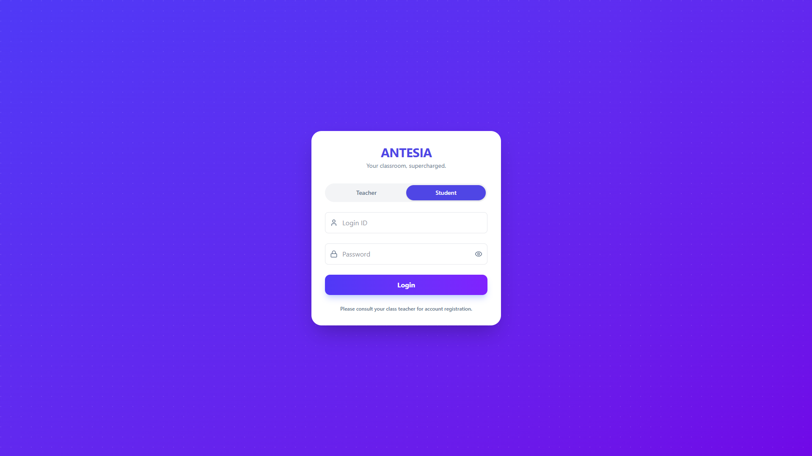
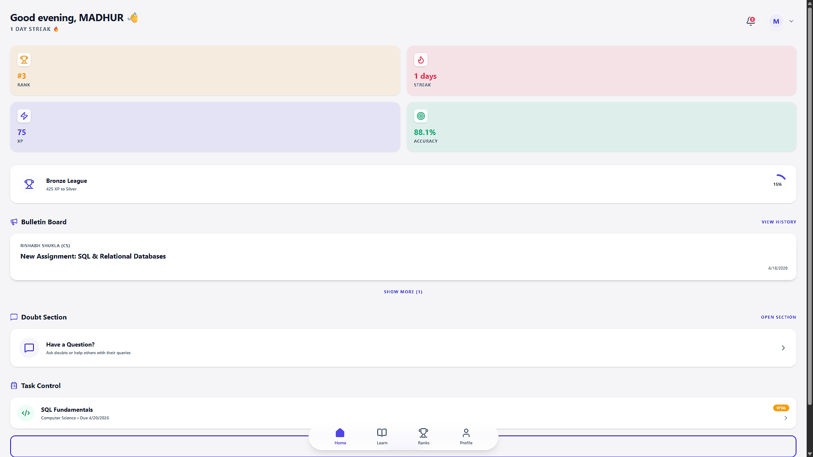
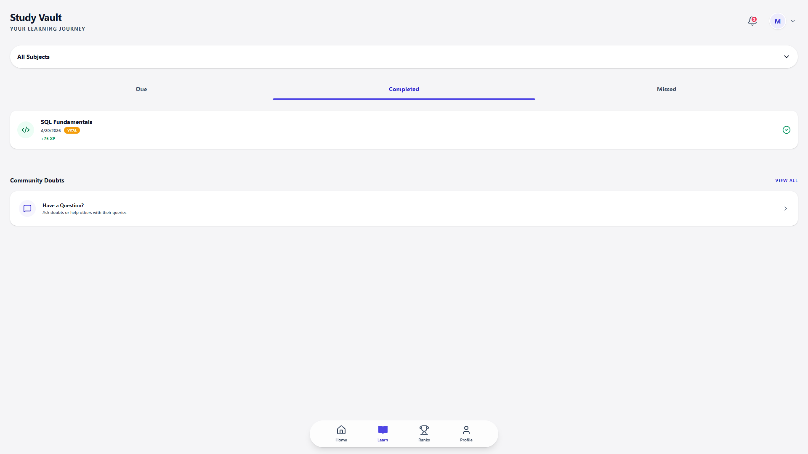
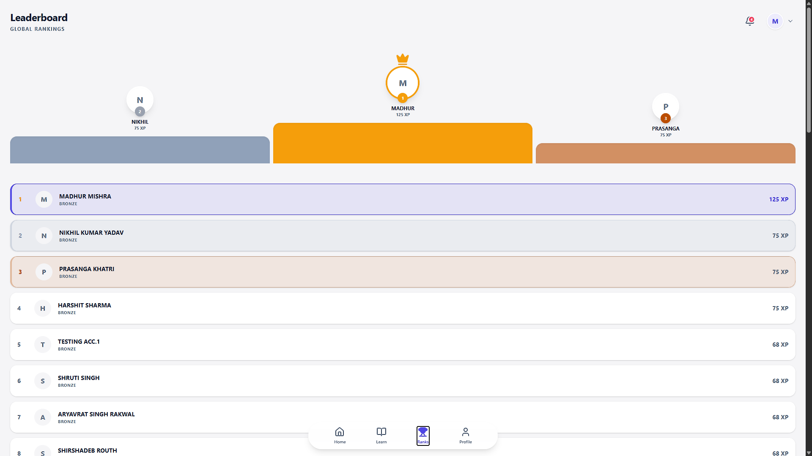
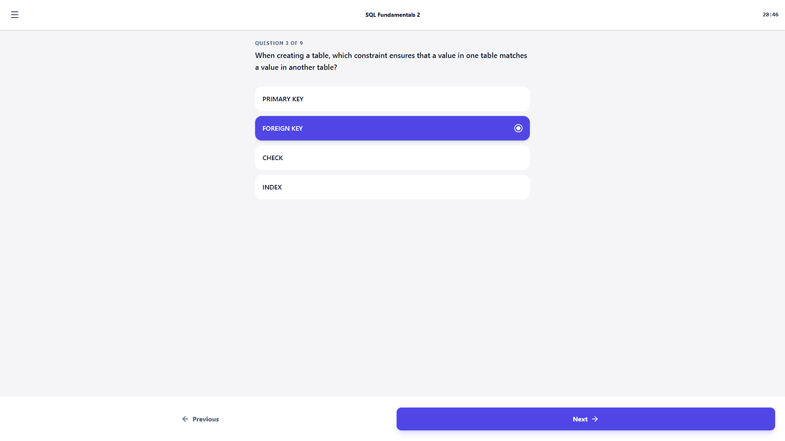
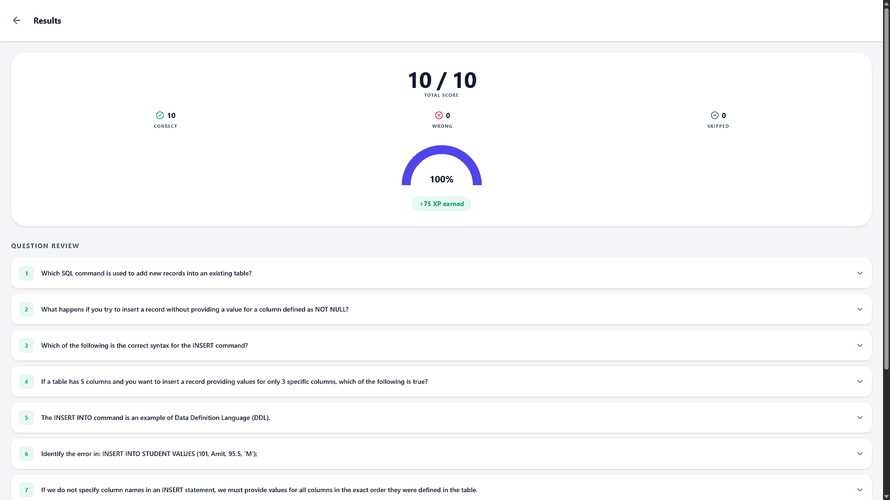
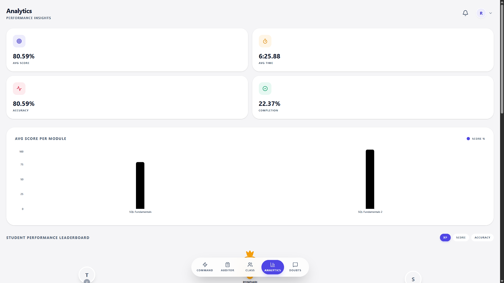
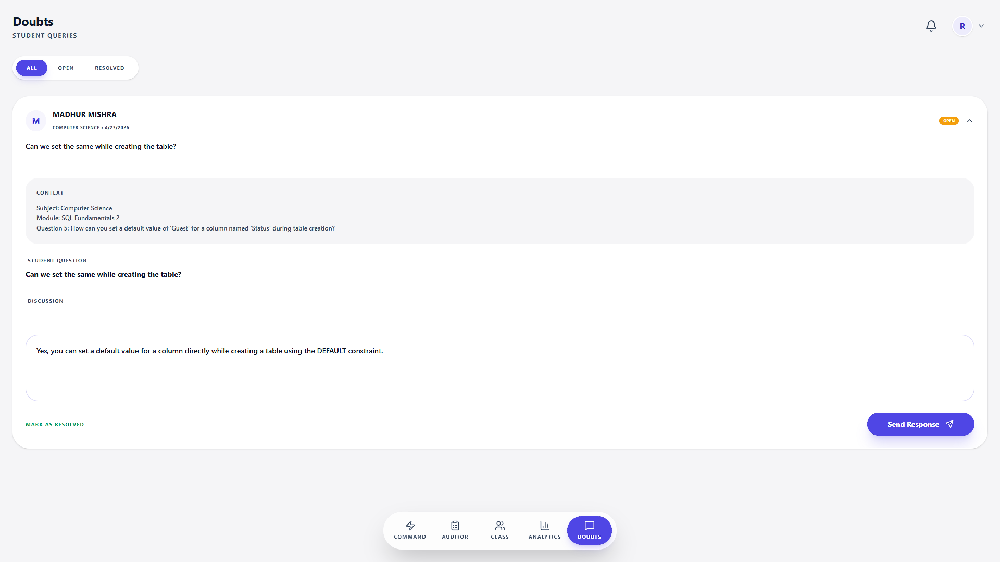

# 🌌 Antesia


**Antesia** is an intelligent, dual-role command center designed for modern education. It bridges the gap between teacher instruction and student execution through a gamified, high-performance interface.

> [!IMPORTANT]
> **m-markup Integration:** Antesia utilizes a customized `m-markup` engine to handle hybrid rendering of Markdown and LaTeX. This ensures that complex scientific equations and academic formatting remain consistent and high-definition across all student and teacher interfaces.

---

## 📸 Screenshots

### **Authentication & Student Hub**
| Secure Login | Student Dashboard | Study Vault |
|---|---|---|
|  |  |  |

### **Gamification & Assignments**
| Global Leaderboard | Assignment UI | Submission Results |
|---|---|---|
|  |  |  |

### **Teacher Command Center**
| Class Analytics | Module Creator | Doubt Management |
|---|---|---|
|  |  |  |

---

## ✨ Core Features

### 👨‍🎓 Student Experience
*   **Intelligent Dashboard**: Real-time tracking of XP, Global Rank, Accuracy, and Streaks with time-aware "Smart Greetings."
*   **Academic Ready**: Native support for **LaTeX/KaTeX** rendering for complex math and science equations.
*   **Interactive Leaderboard**: podiun-style ranking system with "Trailblazer" tie-breaker logic (earlier completion wins ranks).
*   **Study Vault**: Access educational modules with priority labeling (Crucial, Vital, Supporting).
*   **Collaborative Learning**: A built-in doubt section to post questions and help peers.

### 👩‍🏫 Teacher Command Center
*   **The Auditor**: A robust management engine to create, edit, and publish study modules with XP rewards.
*   **Class Analytics**: Deep-dive performance metrics using advanced Recharts visualizations.
*   **Forensic Auditing**: Track student effort including average time per question and subject-wise mastery.
*   **Secure Broadcasting**: Urgent alerts and announcements pushed directly to student feeds.

### 🛡️ Built-in Security
*   **Idle Sentry**: Automatic session termination after **20 minutes** of inactivity using local activity tracking.
*   **Tab-Capture**: Immediate volatile memory (`sessionStorage`) cleanup upon tab closure.
*   **Anti-Spam Login**: Proprietary client-side rate limiting to prevent database overload (Denial of Wallet).
*   **2FA Admin Gate**: Dual-layer verification for administrative access including device fingerprinting.

---

## 🗃️ Database & Schema

Antesia is powered by **Supabase (PostgreSQL)**. The schema is designed for high relational integrity and real-time responsiveness.

### **Manual Setup**
1. Create a new [Supabase Project](https://supabase.com).
2. Navigate to the **SQL Editor**.
3. Copy and run the contents of [`/supabase/schema.sql`](./supabase/schema.sql).
4. (Optional) Enable **Realtime** on the `broadcasts` and `student_stats` tables for live updates.

---

## 📁 Project Structure

```text
src/
├── components/        # Reusable UI components & Skeleton Loaders
├── context/           # Auth & UI State Management
├── lib/               # Database Clients (Supabase) + Mock Configs
├── pages/             # Main Application Views (Student/Teacher/Admin)
├── services/          # API & Logic Helpers
└── types/             # TypeScript interfaces for DB entities
```

---

## 🚀 Installation & Local Setup

### **1. Prerequisites**
*   [Node.js](https://nodejs.org/) (v18+)
*   [Git](https://git-scm.com/)

### **2. Setup**
```bash
# Clone the repository
git clone https://github.com/MadhurMishraX/antesia.git
cd antesia

# Install dependencies
npm install

# Start development server
npm run dev
```

### **3. Environment Variables**
Create a `.env` file in the root directory:
| Variable | Description |
|---|---|
| `VITE_SUPABASE_URL` | Your Supabase Project URL |
| `VITE_SUPABASE_ANON_KEY` | Your Supabase Anon Public Key |
| `VITE_ADMIN_PASSWORD` | Strong password for the Admin Panel |
| `VITE_ADMIN_PIN` | 6-digit PIN for 2FA Admin Verification |

---

## 🚢 Deployment

1. Push your code to **GitHub**.
2. Connect the repository to **Vercel**.
3. Configure the **Environment Variables** in the Vercel Dashboard.
4. **Note:** Ensure your Supabase project's `Site URL` allows your Vercel domain.

---

## 🗺️ Roadmap
- [x] LaTeX/KaTeX Integration
- [x] Dynamic Session Timeout Logic
- [x] Global Leaderboard Tie-breakers
- [ ] AI-Powered Doubt Resolution (Gemini API)
- [ ] Offline PWA Support
- [ ] Parent Progress Portal

---

## 📄 License
This project is licensed under the **GNU General Public License v2.0** - see the [LICENSE](./LICENSE) file for details.

---

## 🙏 Acknowledgements
- [Supabase](https://supabase.com) - Real-time backend & Auth
- [Framer Motion](https://framer.com/motion) - UI Orchestration
- [Lucide](https://lucide.dev) - Professional Iconography
- [Recharts](https://recharts.org) - Visual Data Analytics

---

## 🌌 Developed By
**Madhur Mishra**  
[GitHub](https://github.com/MadhurMishraX) | [LinkedIn](https://www.linkedin.com/in/madhur-mishra-ai)

*"Empowering the next generation of learners through structured achievement."*
