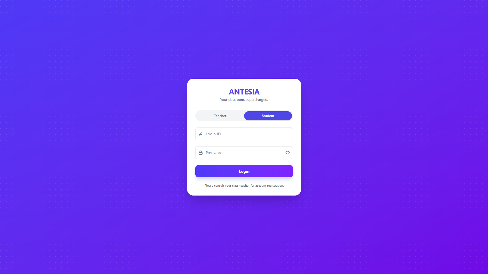
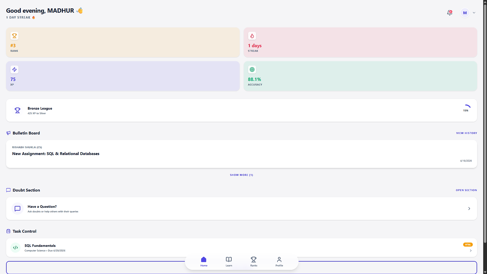
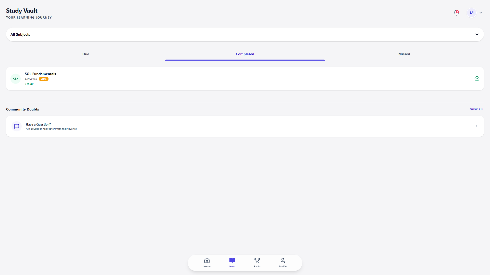
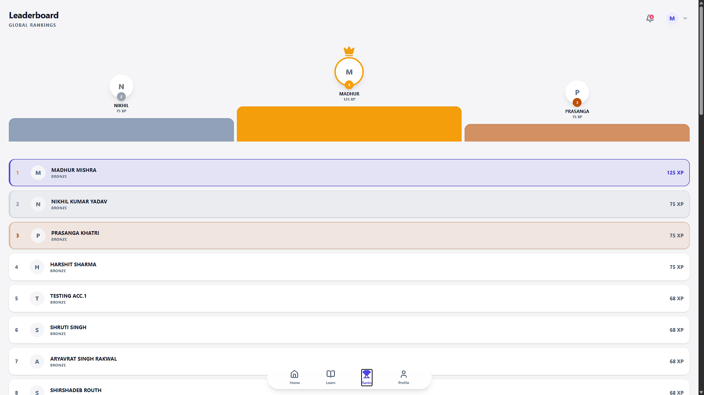
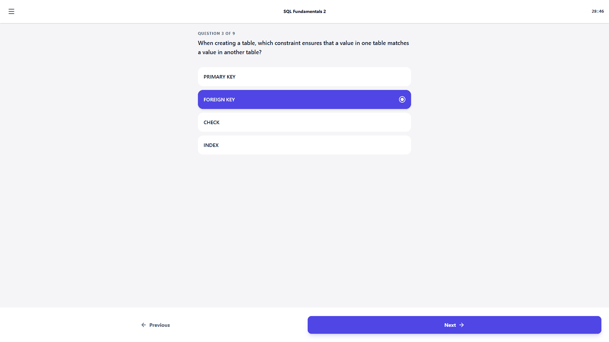
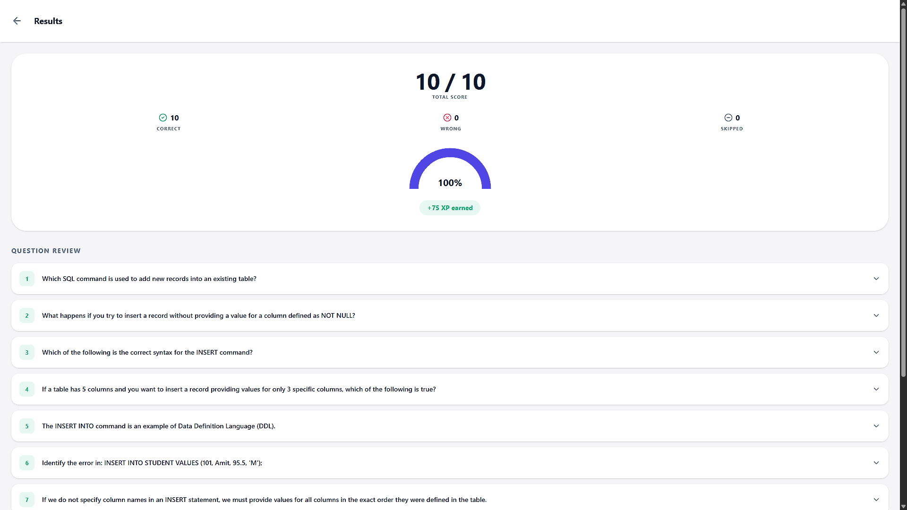
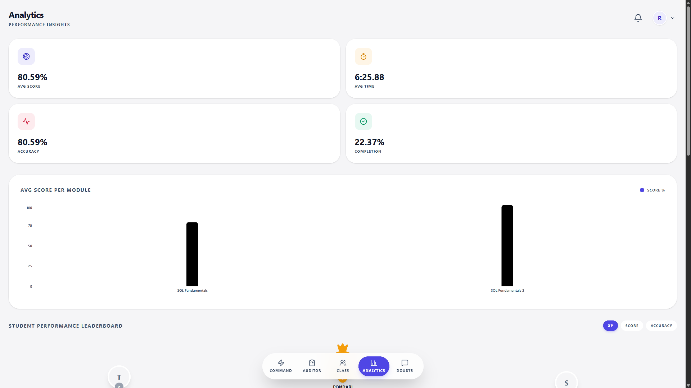
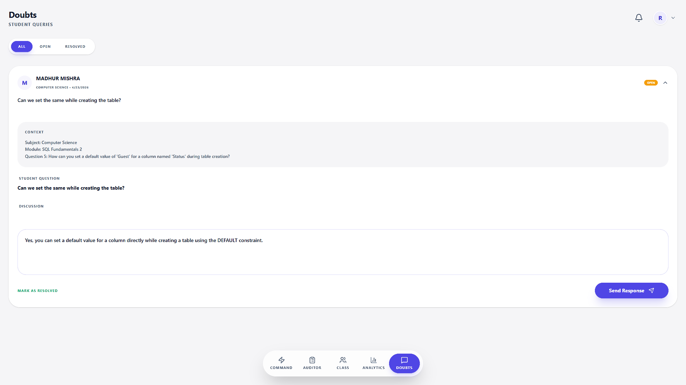

# 🌌 Antesia


**Antesia** is an intelligent, dual-role command center designed for modern education. It bridges the gap between teacher instruction and student execution through a gamified, high-performance interface.

> [!IMPORTANT]
> **m-markup Integration:** Antesia utilizes a customized `m-markup` engine to handle hybrid rendering of Markdown and LaTeX. This ensures that complex scientific equations and academic formatting remain consistent and high-definition across all student and teacher interfaces.

---

## 📸 Screenshots

### **Authentication & Student Hub**
| Secure Login | Student Dashboard | Study Vault |
|---|---|---|
|  |  |  |

### **Gamification & Assignments**
| Global Leaderboard | Assignment UI | Submission Results |
|---|---|---|
|  |  |  |

### **Teacher Command Center**
| Class Analytics | Module Creator | Doubt Management |
|---|---|---|
|  |  |  |

---

## ✨ Core Features

### 👨‍🎓 Student Experience
*   **Intelligent Dashboard**: Real-time tracking of XP, Global Rank, Accuracy, and Streaks with time-aware "Smart Greetings."
*   **Academic Ready**: Native support for **LaTeX/KaTeX** rendering for complex math and science equations.
*   **Interactive Leaderboard**: Podium-style ranking system with "Trailblazer" tie-breaker logic (earlier completion wins ranks).
*   **Study Vault**: Access educational modules with priority labeling (Crucial, Vital, Supporting).
*   **Collaborative Learning**: A built-in doubt section to post questions and help peers.

### 👩‍🏫 Teacher Command Center
*   **The Auditor**: A robust management engine to create, edit, and publish study modules with XP rewards.
*   **Class Analytics**: Deep-dive performance metrics using advanced Recharts visualizations.
*   **Forensic Auditing**: Track student effort including average time per question and subject-wise mastery.
*   **Secure Broadcasting**: Urgent alerts and announcements pushed directly to student feeds.

### 📱 Progressive Web App (PWA)
*   **Offline Access**: Core assets cached via Workbox for reliability in low-connectivity environments.
*   **Install Prompt**: Custom smart-detection logic to trigger installation banners on supported devices.
*   **Standalone Mode**: Full-screen "app-like" experience with custom theme colors and splash screens.
*   **Dynamic Updates**: Auto-refresh strategy to ensure users always run the latest version of the platform.

---

## 🗃️ Database & Schema

Antesia is powered by **Supabase (PostgreSQL)**. The schema is designed for high relational integrity and real-time responsiveness.

### **Manual Setup**
1. Create a new [Supabase Project](https://supabase.com).
2. Navigate to the **SQL Editor**.
3. Copy and run the contents of [`/supabase/schema.sql`](./supabase/schema.sql).
4. (Optional) Enable **Realtime** on the `broadcasts` and `student_stats` tables for live updates.

---

## 📁 Project Structure

```text
src/
├── components/          # Reusable UI components
│   ├── ui/              # Base primitive components
│   ├── ErrorBoundary.tsx# Global error handling
│   ├── InstallPrompt.tsx# PWA installation interface
│   ├── Layout.tsx       # Main app shell & navigation
│   └── TopBar.tsx       # Global header with status indicators
├── context/             # Global State
│   └── AuthContext.tsx  # Supabase auth & user profile sync
├── lib/                 # Utilities & Core Logic
│   ├── constants.ts     # Global configuration & enums
│   ├── mmarkupTranspiler.ts # LaTeX + Markdown engine
│   └── supabase.ts      # Database client initialization
├── pages/               # Main Routed Views
│   ├── student/         # Student-specific dashboard & interfaces
│   ├── teacher/         # Analytics & Content Management (Auditor)
│   ├── AdminLogin.tsx   # Secured admin gate
│   ├── AdminPanel.tsx   # System-wide oversight
│   └── Login.tsx        # Unified authentication portal
├── App.tsx              # Routing & Provider orchestration
└── main.tsx             # Entry point & PWA registration
```

---

## 🚀 Installation & Local Setup

### **1. Prerequisites**
*   [Node.js](https://nodejs.org/) (v18+)
*   [Git](https://git-scm.com/)

### **2. Setup**
```bash
# Clone the repository
git clone https://github.com/MadhurMishraX/antesia.git
cd antesia

# Install dependencies
npm install

# Start development server
npm run dev
```

### **3. Environment Variables**
Create a `.env` file in the root directory:
| Variable | Description |
|---|---|
| `VITE_SUPABASE_URL` | Your Supabase Project URL |
| `VITE_SUPABASE_ANON_KEY` | Your Supabase Anon Public Key |
| `GEMINI_API_KEY` | Key for AI-powered features (optional) |
| `VITE_ADMIN_PASSWORD` | Strong password for the Admin Panel |
| `VITE_ADMIN_PIN` | 6-digit PIN for 2FA Admin Verification |

---

## 🗺️ Roadmap
- [x] LaTeX/KaTeX Integration
- [x] Global Leaderboard Tie-breakers
- [x] Enhanced PWA Offline Support & Install Hooks
- [ ] AI-Powered Doubt Resolution (Gemini API)
- [ ] Parent Progress Portal
- [ ] Multi-class sub-management

---

## 📄 License
This project is licensed under the **GNU General Public License v2.0** - see the [LICENSE](./LICENSE) file for details.

---

## 🙏 Acknowledgements
- [Supabase](https://supabase.com) - Real-time backend & Auth
- [Framer Motion](https://framer.com/motion) - UI Orchestration
- [Lucide](https://lucide.dev) - Professional Iconography
- [Recharts](https://recharts.org) - Visual Data Analytics

---

## 🌌 Developed By
**Madhur Mishra**  
[GitHub](https://github.com/MadhurMishraX) | [LinkedIn](https://www.linkedin.com/in/madhur-mishra-ai)

*"Empowering the next generation of learners through structured achievement."*

